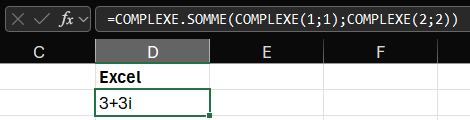

# Python in Excel for electrical engineering

*A couple of initial thoughts after trying Python in MS Excel.*

 * talk about when python made it into excel, and cite MS publication.
 * explain why i use and will keep using jupyter notebooks for technical deliverables (quality and efficiency).
 * maybe define what I consider to be an advanced excel user (xlookup, index, etc.) and an expert excel user (external data and VBA)? Not sure if relevant.
 * show examples at each step.
 * show a formula in Excel (PY) with variable names, comments to the source, etc. vs *the old way*.
 * complex numbers, that'd be a huge improvement in python vs traditional excel.
 * try to include a basic power flow with pandapower in excel; not sure that'd work though (probably can't install packages).

About a month ago [Microsoft announced Python in Excel](https://techcommunity.microsoft.com/t5/excel-blog/announcing-python-in-excel-combining-the-power-of-python-and-the/ba-p/3893439) for users running Beta Channel on Windows, with plans to eventually include this capability in everyone's setup down the road. My main takeaways from this article are:

* Python code can be inserted in cells instead of Excel formulas, and the result is shown in the worksheet.
* An `xl()` function can be used to access cell data in the Python code. ***Does it support ranges?***
* The Python code is executed in the [Microsoft Cloud](https://www.microsoft.com/en/microsoft-cloud), not on your computer, so custom packages likely cannot be installed.
* The MS Cloud setup uses [Anaconda](https://www.anaconda.com/). As stated by Microsoft in [their announcement](https://techcommunity.microsoft.com/t5/excel-blog/announcing-python-in-excel-combining-the-power-of-python-and-the/ba-p/3893439): *Excel users now have access to powerful analytics via Python for visualizations, cleaning data, machine learning, predictive analytics, and more.*
* Some of the included packages: [Matplotlib](https://matplotlib.org/), [Seaborn](https://seaborn.pydata.org/), [scikit-learn](https://scikit-learn.org/stable/index.html), [statsmodel](https://www.statsmodels.org/stable/index.html), [pandas](https://pandas.pydata.org/), [numpy](https://numpy.org/) and many more.
* From the [Microsoft announcement](https://techcommunity.microsoft.com/t5/excel-blog/announcing-python-in-excel-combining-the-power-of-python-and-the/ba-p/3893439): *While in Preview, Python in Excel will be included with your Microsoft 365 subscription. After the Preview, some functionality will be restricted without a paid license.*

While I'd love to see this feature as being *free* (included in everyone's Excel), this is definitely great news for any Python enthousiast.

## Complex numbers

Excel's handling of complex numbers has long irritated me; not only do you need to use a `COMPLEX` function to define complex numbers, you also need functions to compute basic operations such as additions. This is so impractical that electrical quantities are often linearized in Excel for simplicity. While this may not be a problem for a given problem, it is nonetheless frustrating. Here's a simple complex number addition using traditional Excel functions (in French, but the same principle applies to English):

> French function names are annoying.

Using Python:

> Annoying that it shows a `complex` object instead of the value...
