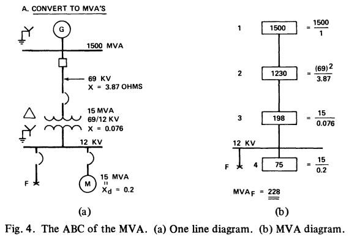

# Short circuit analysis

*My thoughts and methods to simulate ANSI/IEEE short circuit currents in Python.*

This post is really about where I currently stand in my search for open source short circuit calculation solutions in Python. I work in Canada and we use ANSI/IEEE standards, and the open source solutions I have found so far are all based on IEC standards. The IEC standards introduce a few factors that yields different results than ANSI/IEEE's, which make them a bit awkward to use in Canada.

I'm planning on updating this post as I proceed. Please let me know if you feel I missed anything important, I'd be delighted to learn that other viable options exist (scroll down for contact details).

## Short circuit ABC

The method I use most (on paper or with Python) for quick short circuit calculations is the [Short Circuit ABC](https://arcadvisor.com/files/ShortCircuitABC.pdf). It's just great; both precise and vastly faster (and easier) than the per unit method. I strongly encourage anyone not already familiar with it to read the article in the previous link. From its conclusion:

> *The paper described a unique easy to learn and easy to remember method for solving industrial power distribution system short circuit problems. The examples given proved its effectiveness in terms of speed, accuracy, and economy over other conventional Ohmic and per unit methods. The writer has been using it for the past twenty years for many projects, small and large, and found it most effective because it seldom required one to memorize formulas as with other methods.*

I will not get into the details of the method in this post because the paper already does a great job at doing so. My focus is instead on its Python implementation using the example in Figure 4 from the paper, for a 3 phase fault and a 1 phase fault (single phase to ground fault). The example is first computed with no special library, and then awkwardly (because of the ANSI/IEEE vs IEC differences) with [pandapower](https://www.pandapower.org/).



The example yields 11.0 kA for the 3 phase fault, and 12.4 kA for the 1 phase fault per [the paper](https://arcadvisor.com/files/ShortCircuitABC.pdf) (symmetrical RMS).

## MVA method

This section reproduces the MVA method's calculations in Python for the example above.

### 3 phase fault

The only non-standard library I used below is my own [energy_tools](https://pypi.org/project/energy-tools/) for its `parallel` function. I used it for convenience but it could easily be reproduced with a simpler form that doesn't check for errors:

```python
def parallel(*args):
    return 1 / sum([1 / x for x in args])
```


```python
from energy_tools.misc import parallel
```

First, the sources and impedances are created and converted to their short circuit MVA values using either their voltage and impedance ratings (line) and power and short circuit impedance ratings (transformer and motor). The system (utility) is already rated in short circuit MVA:


```python
system_mva = 1500
line_mva = 69**2 / 3.87  # 3.87 ohm @ 69 kV
xfo_mva = 15 / 0.076  # 7.6% @ 15 MVA
motor_mva = 15 / 0.2  # 20% @ 15 MVA
```

Then, the short circuit MVA values are combined in series and parallel per the method in the paper (i.e.: short circuit MVA values in series are combined in parallel, and vice-versa):


```python
upstream_mva = parallel((system_mva, line_mva, xfo_mva))
sc_mva = upstream_mva + motor_mva
```

Finally, the results are shown in kA and MVA:


```python
sc_ka = sc_mva / (12 * 3**0.5)
print(f"3 phase fault = {sc_ka:.1f} kA ({sc_mva:.1f} MVA)")
```

    3 phase fault = 11.0 kA (227.8 MVA)


### 1 phase fault

A few variations are required and explained starting from page 5/12 of [the paper](https://arcadvisor.com/files/ShortCircuitABC.pdf) in section "Can Phase-Ground Fault Be Solved?". First, the negative sequence short circuit MVA is assumed equal to the positive sequence:


```python
sc_neg_mva = sc_mva
```

Then, the transformer's zero sequence reactance is equal to its positive and negative sequence reactances:


```python
xfo0_mva = xfo_mva
```

The motor's zero sequence reactance is about ½ of its positive sequence reactance:


```python
motor0_mva = 2 * motor_mva
```

Then, the short circuit MVA values are combined for a single phase to ground fault:


```python
sc0_mva = xfo0_mva + motor0_mva
sc0_mva = parallel((sc_mva, sc_neg_mva, sc0_mva)) * 3
```

Finally, the results are shown in kA and MVA:


```python
sc0_ka = sc0_mva / (12 * 3**0.5)
print(f"1 phase fault = {sc0_ka:.1f} kA ({sc0_mva:.1f} MVA)")
```

    1 phase fault = 12.4 kA (257.3 MVA)


### MVA method conclusion

The MVA method in Python is great for simple calculations such as this one, I regularly use it to size equipment using conservative simplifications and it can easily be integrated into a calculation note (i.e.: not a complete system short circuit study).

## Pandapower

### 3 and 1 phase faults

[pandapower](https://www.pandapower.org/) is a powerful and mature power system simulation tool I use regularly to automate power flow studies. It also supports [short circuit calculations](https://pandapower.readthedocs.io/en/latest/shortcircuit.html) albeit they are currently conducted solely per IEC 60909, not ANSI/IEEE.

I am no expert on IEC 60909 short circuit calculations (have never had to conduct one in my work), but my understanding of it is that its correction factors are the key reasons why its results deviate from ANSI/IEEE calculations. This article from [EasyPower](https://www.easypower.com/) - another commercial power system software - provides straightforward explanations for each correction factor used in their IEC simulations: [IEC-60909 Short-Circuit in EasyPower](https://www.easypower.com/resources/article/iec-60909-short-circuit-in-easypower)


```python
import pandapower as pp
import pandapower.shortcircuit as sc
```

First, an empty network is created:


```python
net = pp.create_empty_network(f_hz=60.0)
```

Then, network components are added:


```python
# Create buses
bus0 = pp.create_bus(net=net, vn_kv=69)
bus1 = pp.create_bus(net=net, vn_kv=69)
bus2 = pp.create_bus(net=net, vn_kv=12)
```

The X/R ratio is assumed to be ~infinite to simplify calculations, as in [the paper](https://arcadvisor.com/files/ShortCircuitABC.pdf), by setting each resistance to 1e-20:


```python
# Create utility
pp.create_ext_grid(
    net=net,
    bus=bus0,
    s_sc_max_mva=1500,
    rx_max=1e-20,
    rx_min=1e-20,
    x0x_max=1,  # For 1 phase fault
    r0x0_max=1,  # For 1 phase fault
);
```

To compensate for the votlage correction factor builtin [pandapower](https://www.pandapower.org/), the line impedance is increased by 10%:


```python
# Create line
pp.create_line_from_parameters(
    net=net,
    from_bus=bus0,
    to_bus=bus1,
    length_km=1,
    r_ohm_per_km=1e-20,
    x_ohm_per_km=3.87 * 1.1,  # To remove IEC voltage correction factor
    c_nf_per_km=1e-20,
    r0_ohm_per_km=1e-20,
    x0_ohm_per_km=1e-20,
    c0_nf_per_km=1e-20,
    max_i_ka=1,
);
```


```python
# Create transformer
xfo_3ph = pp.create_transformer_from_parameters(
    net=net,
    hv_bus=bus1,
    lv_bus=bus2,
    sn_mva=15,
    vn_hv_kv=69,
    vn_lv_kv=12,
    vkr_percent=1e-20,
    vk_percent=7.6 * 1.1,  # To remove IEC voltage correction factor
    pfe_kw=1e-20,
    i0_percent=1e-20,
    vector_group="Dyn",  # For 1 phase fault
    vkr0_percent=1e-20,  # For 1 phase fault
    vk0_percent=1e-20,  # For 1 phase fault
    mag0_percent=1e-20,  # For 1 phase fault
    si0_hv_partial=1e-20,  # For 1 phase fault
    mag0_rx=1e-20,  # For 1 phase fault
)
```

For the 1 phase fault I used a non-professional factor through trial and error... I would investigate further but the best solution would be to allow [pandapower](https://www.pandapower.org/) to run ANSI/IEEE short circuit calculations without IEC correction factors. I plan on putting whatever time I can on this solution rather than detailing why this ratio appears to yield correct results (and check if it does so for other problems):


```python
# Create transformer
xfo_1ph = pp.create_transformer_from_parameters(
    net=net,
    hv_bus=bus1,
    lv_bus=bus2,
    sn_mva=15,
    vn_hv_kv=69,
    vn_lv_kv=12,
    vkr_percent=1e-20,
    vk_percent=7.6 * 2.915,  # Trial and error...
    pfe_kw=1e-20,
    i0_percent=1e-20,
    vector_group="Dyn",  # For 1 phase fault
    vkr0_percent=1e-20,  # For 1 phase fault
    vk0_percent=1e-20,  # For 1 phase fault
    mag0_percent=1e-20,  # For 1 phase fault
    si0_hv_partial=1e-20,  # For 1 phase fault
    mag0_rx=1e-20,  # For 1 phase fault
)
```


```python
# Create motor with an X1 of 0.2 pu
motor_3ph = pp.create_sgen(
    net=net,
    bus=bus2,
    p_mw=1e-20,
    sn_mva=15,
    type="motor",
    k=5,
    rx=1e-20,
)
```


```python
# Create motor with an X0 of 0.1 pu
motor_1ph = pp.create_sgen(
    net=net,
    bus=bus2,
    p_mw=1e-20,
    sn_mva=15,
    type="motor",
    k=10,
    rx=1e-20,
)
```


```python
buses = [
    # bus  id kv  single_phase
    # (bus0, 0, 69, False),
    # (bus1, 1, 69, False),
    (bus2, 2, 12, True),
]
```

To generate results for 3 phase and 1 phase faults, the transformer and motor models must be switched on or off in the model. This should not be necessary but it is because of the transformer impedance hack which differs for each fault type, and the motor fault contribution which also differs in the example.


```python
for bus, id, kv, single_phase in buses:
    # Enable models for 3 phase fault
    net.trafo.at[xfo_3ph, "in_service"] = True
    net.sgen.at[motor_3ph, "in_service"] = True

    # Disable models for 1 phase fault
    net.trafo.at[xfo_1ph, "in_service"] = False
    net.sgen.at[motor_1ph, "in_service"] = False

    print(f"Bus {id} ({kv} kV):")

    # Run 3 phase short circuit calculation
    sc.calc_sc(net=net, bus=bus)

    sc_ka = net.res_bus_sc.loc[id, "ikss_ka"]
    sc_mva = sc_ka * kv * 3**0.5
    print(f" * 3 phase fault = {sc_ka:.1f} kA ({sc_mva:.1f} MVA)")

    if single_phase:
        # Disable models for 3 phase fault
        net.trafo.at[xfo_3ph, "in_service"] = False
        net.sgen.at[motor_3ph, "in_service"] = False

        # Enable models for 1 phase fault
        net.trafo.at[xfo_1ph, "in_service"] = True
        net.sgen.at[motor_1ph, "in_service"] = True

        # Run 1 phase short circuit calculation
        sc.calc_sc(net=net, bus=bus, fault="1ph")

        sc_ka = net.res_bus_sc.loc[id, "ikss_ka"]
        print(f" * 1 phase fault = {sc_ka:.1f} kA")
```

    Bus 2 (12 kV):
     * 3 phase fault = 11.0 kA (228.3 MVA)
     * 1 phase fault = 12.4 kA


### Pandapower conclusion

I can't recommend that anyone use [pandapower](https://www.pandapower.org/) for ANSI/IEEE short circuit calculations in its current form; using the hacks above is not only prone to errors, but it complicates quality control, invalidates any other calculation on the network (e.g.: power flow simulation), and lacks credibility.

The ideal solution would be to work with the developpers to propose an alternative ANSI/IEEE short circuit calculation that skips the IEC correction factors; this should be relatively straightforward (removing correction factors should be simpler than adding them), and this is where I would like to contribute.

An alternative which I might use for preliminary studies, is to use IEC results but be mindful of the safety margins added by the IEC correction factors while working with the results. For example, a margin of at least 10% for faults beyond 1 kV, and 5% below 1 kV, is added to the fault currents simply by using the voltage factors. The other corrective factors all add additional margins for specific components.

## Other potential solutions

[GridCal](https://www.advancedgridinsights.com/gridcal) supports short circuit calculations, but I was not able to reproduce the results for the example above (neither with the GUI or the CLI). I plan on investigating the issue because its GUI (graphical user interface) is very interesting for quality control and training, even if I mostly use the CLI.

[ETAP has a Python API](https://etap.com/product/etappy). Last time I check (a few years ago) the API didn't allow us to create models from scratch, which is a problem for most of my use cases. That might have changed; I'll run some tests on the latest version. Note that this is a commercial software.

[PSSE](https://www.siemens.com/global/en/products/energy/grid-software/planning/pss-software/pss-e.html) has supported Python for a while and its model files can be generated with Python scripts. There's even a [forum dedicated to using Python for PSSE](https://psspy.org/). I have generated and work with PSSE RAW files but have yet to try its simulation features. Note that this is also a commercial software.

## Final thoughts

I was a bit disappointed that I could not find any open source solution that performed automatic ANSI/IEEE short circuit calculations in Python out of the box. While the MVA method is easy to use in simple problems, it is unpractical for large distribution models because the contributions have to be combined manually. For preliminary calculations on complex networks I might use [pandapower](https://www.pandapower.org/) and be mindful of its IEC correction factors, but for final calculations I would have to rely on commercial softwares such as [ETAP](https://etap.com/), [EasyPower](https://www.easypower.com/) and [PSSE](https://www.siemens.com/global/en/products/energy/grid-software/planning/pss-software/pss-e.html).

I hesitated before publishing this article because it is rather incomplete, but I decided to proceed to share my thoughts, motivate me to contribute solutions and invite feedback from readers. Please reach out if you believe I missed anything important, I will update the article accordingly!
