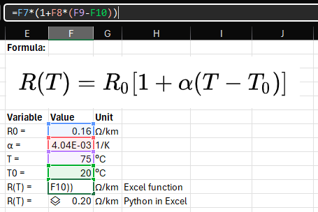

# Python in Excel

*A couple of initial thoughts after trying Python in MS Excel.*

About a month ago [Microsoft announced Python in Excel](https://techcommunity.microsoft.com/t5/excel-blog/announcing-python-in-excel-combining-the-power-of-python-and-the/ba-p/3893439) for users running Beta Channel on Windows, with plans to eventually include this capability in everyone's setup. My key takeaways from this article are:

* Python code can be inserted in cells instead of Excel formulas, and the result is shown in the worksheet.
* An `xl()` function can be used to access cell data in the Python code.
* The Python code is executed in the [Microsoft Cloud](https://www.microsoft.com/en/microsoft-cloud), not on your computer, so custom packages likely cannot be installed.
* The MS Cloud setup uses [Anaconda](https://www.anaconda.com/). As stated by Microsoft in [their announcement](https://techcommunity.microsoft.com/t5/excel-blog/announcing-python-in-excel-combining-the-power-of-python-and-the/ba-p/3893439): *Excel users now have access to powerful analytics via Python for visualizations, cleaning data, machine learning, predictive analytics, and more.*
* Some of the included packages: [Matplotlib](https://matplotlib.org/), [Seaborn](https://seaborn.pydata.org/), [scikit-learn](https://scikit-learn.org/stable/index.html), [statsmodel](https://www.statsmodels.org/stable/index.html), [pandas](https://pandas.pydata.org/), [numpy](https://numpy.org/) and many more.
* From the [Microsoft announcement](https://techcommunity.microsoft.com/t5/excel-blog/announcing-python-in-excel-combining-the-power-of-python-and-the/ba-p/3893439): *While in Preview, Python in Excel will be included with your Microsoft 365 subscription. After the Preview, some functionality will be restricted without a paid license.*

 

While I'd love to see this feature as being *free* (i.e.: included in everyone's Excel), this is definitely great news for any Python enthousiast.

This is still very new and probably subject to change, but I've had the chance to play around with this feature and wanted to share a few observations and thoughts. I use Excel extensively at work and this will certainly make it so much more enjoyable!

## Complex numbers

Excel's handling of complex numbers has long irritated me; not only do you need to use a `COMPLEX` function to define complex numbers, you also need functions to compute basic operations such as additions. This is so impractical that electrical quantities are often linearized in Excel for simplicity. While this may not be a problem for a given problem, it is nonetheless frustrating.

Here's a simple complex number addition using traditional Excel functions (in French, but the same principle applies to English; `SOMME` = `SUM`):

This equation of complex numbers could hardly be simpler, but it is already barely readable. This also implies that one has to *know* beforehand if the input variables (ex.: from other cells) might be a complex number and take appropriate measures when developing formulas accessing those input variables.

No function, special step or consideration has to be taken with Python:

While it's annoying that it shows a `complex` object instead of the value, the formula itself is much more readable and complex mathematical operations can more easily be understood.

## Comments and variables

One thing I particularly like about Python in Excel is the fact that the code can contain multiple lines, including comments, variable definitions, and computation steps. This may make code easier to review than a simple Excel formula with not much effort from the coder.

Here's an example to calculate the resistance of a copper conductor based on its temperature, as explained in [this Wikipedia article](https://en.wikipedia.org/wiki/Electrical_resistance_and_conductance#Temperature_dependence). The formula is:

$R(T) = R_0 [1+\alpha(T-T_0)]$

Where:

* ***R(T)*** : The conductor resistance at temperature ***T***.
* ***R0*** : The conductor resistance at temperature ***T0*** (let's use 0.16 Ω/km for a 4/0 AWG copper cable per [this reference](https://web.archive.org/web/20100612210109/http://www.cvel.clemson.edu/emc/calculators/Resistance_Calculator/wire.html)).
* ***α*** : An empirical parameter fitted from measurement data (4.04 × 10−3 K−1 per [this reference](https://en.wikipedia.org/wiki/Electrical_resistivity_and_conductivity#Resistivity_and_conductivity_of_various_materials)).
* ***T*** : The target temperature.
* ***T0*** : A fixed reference temperature (usually room temperature) (20 °C per [this reference](https://en.wikipedia.org/wiki/Electrical_resistivity_and_conductivity#Resistivity_and_conductivity_of_various_materials)).

 

Here's how it might look with an Excel formula:

A better way to do it would be to use Excel cell names; I don't like to use those because they aren't as flexible as I would like them to be, but it certainly looks cleaner:

With Python, we are unrestrained and can add comments (and references), units, intermediary variables, etc. to make it even clearer. I believe that's even better than using cell names:

### Working with cells

A few interesting things caught my attention while doing this example:

* You can click on another cell from the `PY` prompt to automatically add the `xl("F7")` reference.
* Cell references with Python code get updated automatically as cells are moved around, exactly like normal Excel functions from what I can tell.
* Range of cells return a [pandas DataFrame object](https://pandas.pydata.org/docs/reference/api/pandas.DataFrame.html)!

## Project deliverable

A few years ago my colleagues and myself have made the decision of using [Jupyter Notebooks](https://jupyter.org/) instead of Excel spreadsheets to prepare calculation notes for our projects, for 2 key reasons:

* **Efficiency:**
  * To prepare professional deliverables with a spreadsheet based calculation, we usually resorted to presenting the methodology and output in an MS Word document. This involved copying and pasting parts of the spreadsheet manually, usually repeatedly as calculations were revised (which is normal in the project's lifecycle).
  * This is no longer necessary because [Jupyter Notebooks can easily be formatted professionally by using LaTeX and Markdown](https://jupyter-notebook.readthedocs.io/en/stable/examples/Notebook/Working%20With%20Markdown%20Cells.html).
* **Quality:**
  * By eliminating the copy / paste process between the spreadsheet and the deliverable, a major source of error was nullified.
  * In a spreadsheet, formulas are hidden when the document is viewed and printed (unless a cell is selected). Controlling the quality of the logic must therefore be done with the original spreadsheet, not its output (ex.: PDF).
  * The order of execution can be chaotic in a spreadsheet, especially as complexity increases. We have had to build flowcharts to explain in which order big Excel files had to be used, whereas it's obvious in notebooks (from top to bottom).

 

Python in Excel doesn't change that; I'd argue it could make the problem worse by adding complexity for non-Python people, and encouraging more code to be hidden in cells. Nonetheless, spreadsheets are not going away and Python could be extremely useful.

## The dreaded VBA

I perhaps simplistically consider advanced Excel users as those able to handle [XLOOKUP with multiple criteria](https://exceljet.net/formulas/xlookup-with-multiple-criteria), and power users are those able to handle [Power Query](https://support.microsoft.com/en-gb/office/about-power-query-in-excel-7104fbee-9e62-4cb9-a02e-5bfb1a6c536a) and develop [Excel VBA](https://learn.microsoft.com/en-us/office/vba/api/overview/excel).

As shown in [Stack Overflow's 2021 survey](https://insights.stackoverflow.com/survey/2021#most-loved-dreaded-and-wanted-language-love-dread), VBA is one of the most dreaded programming languages. It is rather unavoidable when developing MS Excel spreadsheets beyond a certain complexity, and a Python alternative would be more than welcome.

There are several ways to use Python in combination with Excel but one officially supported by Microsoft would significantly help broad enterprise adoption. In addition, younger employees are increasingly entering the workplace with basic Python skills.

## Closing thoughts

I am so happy about this! I've been advocating for years for colleagues to learn and use Python in the workplace and it is slowly making its way into various engineering tools (ex.: [etapPy - Scripting & Study Automation using Python](https://etap.com/product/etappy)). Everyone uses Excel, and more widespread adoption of Python in the workplace will make it easier to support the development of this skill amongst more people.

Nonetheless, I don't think this will make Excel any more suited to support complex tasks. Automated testing won't be easier, nor will version control. I will keep using python modules and Jupyter Notebooks for those, and encourage others to do so. I wouldn't want people to look at complex spreadsheets and blame Python for the spreadsheets' lack of clarity and readability.

Finally, Python in Excel is still quite new, I've barely scratched the surface, and I might have misunderstood some parts (ex.: testing / version control). I'll keep playing around with it and look for what others have to say about it.
