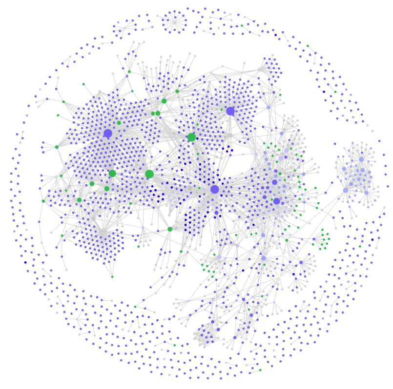

# Building a Personal Knowledge Base with Obsidian

*Why I am letting myself get addicted to this amazing and productive piece of software.*

In the dynamic world of engineering and technical design, the ability to navigate a sea of information efficiently is paramount. For junior designers and seasoned professionals alike, the process of accumulating, organizing, and accessing a wealth of knowledge is not just a best practice; it's a career-enhancing skill. Over the years, I went through several tools, systems and methods to organize my knowledge base and believe I have finally found the solution I was yearning for: [Obsidian](https://obsidian.md/).

> See [here](https://obsidian.rocks/getting-started-with-obsidian-a-beginners-guide/) for a nice guide on how to get started with [Obsidian](https://obsidian.md/). This isn't one.

## The Importance of Building a Knowledge Base

As a junior designer, the sheer volume of information encountered daily can be overwhelming. The significance of documenting lessons learned, tricks of the trade, guides, references, and recommendations cannot be overstated. A personal knowledge base serves as a repository for the collective wisdom acquired through one's experience and, if you're lucky, through your mentors'.

It allows you to solve new problems and support new colleagues efficiently. Documenting and organizing this knowledge not only aids personal development but also facilitates seamless collaboration within teams. Sharing your knowledge, one way or another, transforms individual insights into shared resources, fostering a culture of continuous learning and innovation. The act of recording experiences not only solidifies understanding but also ensures that valuable lessons are preserved for future reference.

## My Journey

### From Paper to Obsidian

In the quest for an optimal knowledge management solution, I explored various tools, each with its strengths and limitations. I have lost track of some tools but I have used simple and relatively complex solutions including [OneNote](https://www.onenote.com/), [Tomboy](https://wiki.gnome.org/Apps/Tomboy), [Google Keep](https://keep.google.com/), [DokuWiki](https://www.dokuwiki.org/), [Dropbox](https://www.dropbox.com/), [Google Drive](https://drive.google.com/), [Mayan EDMS](https://www.mayan-edms.com/), paper logbooks, physical binders and even the classic paper notes. All had their merits, yet none encapsulated the versatility I sought until I discovered Obsidian.

**Paper Notes:** Think of the environment! There are better solutions in this day and age.

**Google Keep (and alternatives):** I still use it for shared task lists, but it lacks the structure and interconnectedness necessary for a comprehensive knowledge base.

**OneNote:** My notes can be but are not necessarily hierarchical, and [OneNote](https://www.onenote.com/) imposes its structure with a very limited number of levels. I need to be able to seamlessly interconnect my notes with no fixed structure, unless desired. Something like those scenes in movies where characters present notes on the wall interconnected with strings or yarn or otherwise.

**Dropbox/Google Drive:** A key feature in a knowledge base is the ability to find information through various means; a hierarchical structure (files and folders) and a search feature are not sufficient. This lead me to the next solution.

**Mayan EDMS:** An [electronic document management system (EDMS)](https://en.wikipedia.org/wiki/Document_management_system) is great for storing and retrieving documents! In addition to the hierarchical structure, [Mayan EDMS](https://www.mayan-edms.com/) provides various means of indexing and searching based on metadata and tags. I have used it happily for years but limited its use to *documents*; it isn't suited for notes and other bits of information.

I stopped using it when my home server died, and I set up its replacement. [Mayan EDMS](https://www.mayan-edms.com/) now requires [docker](https://www.docker.com/) and my platform doesn't support it easily. Last weekend I completed the migration of my documentation from my Mayan backups (files and database) to [Obsidian](https://obsidian.md/) using a [Python](https://www.python.org/) script (I'd be happy to share it if anyone's interested).

**DokuWiki:** A personal wiki provided what an EDMS didn't: A note-taking application based on interconnectability and flexibility. [DokuWiki](https://www.dokuwiki.org/) is simple to setup and to use, but it didn't feel dynamic and modern. Editing pages requires a few too many steps and it doesn't offer the hierarchical structure of files and folders I desired; only the connections between pages I manually entered. I ended up not using it as much as I should have and let it be slowly forgotten.

#### Vendor Lock-In

There are ways to retrieve data from each of these solutions, but they do require extra steps. For example, [Mayan EDMS](https://www.mayan-edms.com/) renames files as [UUID](https://en.wikipedia.org/wiki/Universally_unique_identifier) (with no extension) and stores all metadata in a database. [DokuWiki](https://www.dokuwiki.org/) stores pages as text files with a format similar to [Markdown](https://en.wikipedia.org/wiki/Markdown), but not identical. I have used other solutions in the past which made it really hard to export data to open formats, and have therefore lost precious information along the way. My ideal solution has to be completely open; [Markdown](https://en.wikipedia.org/wiki/Markdown) files synchronized across different platforms with an efficient and clean interface would be best.

### The Obsidian Advantage

[Obsidian](https://obsidian.md/) stood out as a game-changer. Its bi-directional linking system, [Markdown](https://en.wikipedia.org/wiki/Markdown) support, and graph view feature offered a dynamic and interconnected platform for weaving a web of knowledge. Unlike traditional note-taking tools, [Obsidian](https://obsidian.md/) allows me to seemlessly create relationships between ideas, topics, and documents.

As of this writing, there are 1331 plugins made by the community for Obsidian and share on its website. My favorite one is the [Dataview](https://github.com/blacksmithgu/obsidian-dataview) plugin:

> Treat your [Obsidian Vault](https://obsidian.md/) as a database which you can query from. Provides a JavaScript API and pipeline-based query language for filtering, sorting, and extracting data from Markdown pages.

I use it to create dynamic [maps of content (MOC)](https://obsidian.rocks/maps-of-content-effortless-organization-for-notes/) to my notes based on location (folder structure), metadata and tags. Applying it with the [Templater plugin](https://silentvoid13.github.io/Templater/) completely replaces my previous [DMS](https://en.wikipedia.org/wiki/Document_management_system):

> [Templater](https://github.com/SilentVoid13/Templater) is a template plugin for [Obsidian.md](https://obsidian.md/). It defines a templating language that lets you insert variables and functions results into your notes. It will also let you execute JavaScript code manipulating those variables and functions.

Finally, I use the [Tasks plugin](https://publish.obsidian.md/tasks/Introduction) to supplement tasks management with convenient features such as priorisation, deadlines, etc.

The flexibility of [Obsidian](https://obsidian.md/) accommodates a range of content types, from text notes and code snippets to images and PDFs, creating a unified space for diverse forms of information.

## My Obsidian Vault

### Professional vs Personal

[Obsidian](https://obsidian.md/) stores data in vaults, i.e.: a structure of files and folders. At first, I created a vault for personal use and one for professional use, but it quickly became apparent that my personal interests were closely linked to my professional ones. Splitting them into 2 vaults was inefficient and unnecessary; I merged them after a few weeks.

I dislike thinking about work when I do not intend to, hence I use the [Homepage](https://github.com/mirnovov/obsidian-homepage) plugin to open either a `Work` or `Personal` note when I launch [Obsidian](https://obsidian.md/), depending on the device I'm using. I use [Obsidian's Sync service](https://obsidian.md/sync) to synchronize my vault across devices, and leave community plugins out of sync to allow me to have different homepages on different PCs (by default, [Homepage](https://github.com/mirnovov/obsidian-homepage) only allows you to have different homepages between PC and mobile).

### Organization

I organized my vault following [these recommendations](https://help.noteplan.co/article/155-how-to-organize-your-notes-and-folders-using-johnny-decimal-and-para), with the following caveats. I found this system intuitive and logical; sorting notes in each [PARA](https://noteplan.co/blog/implementing-para-in-noteplan/) folder appears obvious and I have yet to feel like a category is missing with close to 4000 notes and files. Indexing with the [Johnny.Decimal system](https://johnnydecimal.com/) helps keep everything organized and navigable:

- My homepages are stored under `00 Home`, the complete structure looks somewhat like this (simplified):

	- `00 Home`
		- `01 Work`
		- `02 Personal`
	- `10 Projects` (only active projects; inactive ones go in `40 Archives`)
	- `20 Areas` (e.g.: management, health, interests)
	- `30 Resources` (e.g.: publications, guides, out-of-project notes)
		- `39 Media` (for any image pasted into my notes)
	- `40 Archives`
- I have not (yet) delved into the [Zettelkasten](https://noteplan.co/blog/my-zettelkasten-workflow/) method / philosophy; perhaps later.

 

A ***great*** feature of [Obsidian](https://obsidian.md/) is its automatic updating of links as the vault changes. For example, I might decide to rename a note or renumber `22 Personal` to `23 Personal` sometime in the future, and [Obsidian](https://obsidian.md/) would seamlessly adjust each note referencing these. I do this almost daily because the structure of my vault evolves as I add content. Unfortunately the subfolders won't be renumbered automatically (ex.: `22.1 Health` would not be renamed to `23.1 Health`).

### Graph View

The graph view shows each note in a vault as a node, and its connections to other notes as branches. Nodes repel each other and connections provide attraction, creating beautiful and satisfying graphs which can be more than simply fanciful.

The effectivement of a knowledge base could be measured by the ease of retrieving relevant information. While [PARA](https://noteplan.co/blog/implementing-para-in-noteplan/) and [Johnny.Decimal](https://johnnydecimal.com/) do a lot of the heavy lifting, in addition to tags and other metadata, relationship with notes can be *extremely* effective for locating data. The more ways there are to find relevant data, the better. An isolated note in the graph view has no link to tags, nodes and indices; they would show up through searches and navigation, but that's it. I view this as a problem and the graph view helps me find and address those.

This might be somewhat vague; let's look at an example:

> I have to design an electrical protection system for a hydro generator and need to retrieve examples, publications, books and standards on the subject. Examples are either stored under `10 Projects/11 Work` for current projects, `30 Resources/38 Examples`, and `40 Archives` for old projects. Publications, books and standards are stored in distinct subfolders of `30 Resources/34 Technical`. I *could* try to locate relevant information through navigation and searches, but the most efficient way is to look for the `#generator` and `#protection` tags in combination.
> If this is a common search, I could also create a [Map of Content (MOC)](https://obsidian.rocks/maps-of-content-effortless-organization-for-notes/) to locate these more easily, include and show custom data such as personal appreciation, etc. I try to create these as I go, using [dataview queries](https://blacksmithgu.github.io/obsidian-dataview/queries/structure/) instead of simply searching.
> There are tons of other examples, e.g.: find good examples of arc flash study reports, lastest X meetings involving a given project, etc.

I color coded my graph per index; purple - the color used for notes under `30 Resources` - overwhelms the rest as I have mostly fed my vault with meeting notes and people (the central cluster), and importations from my DMS (the peripheral free-floating nodes) and personal wiki (the small cluster on the top right).

### Security & Privacy

[As explained on Obsidian's website](https://help.obsidian.md/Obsidian+Sync/Security+and+privacy), the sync service offers an encryption option that "guarantees that no one - not even the Obsidian team - can access your notes."

Outside of the sync service, notes are stored as simple text files on your device (or rather, as [Markdown](https://en.wikipedia.org/wiki/Markdown) files). It's up to the user to protect these, but I recommend using [full disk encryption](https://en.wikipedia.org/wiki/Disk_encryption) if possible, especially on portable (i.e.: stealable) devices.

I also recommend running automated & encrypted remote backups, for example using [Duplicity](https://duplicity.us/). I store my backups on [IDrive e2](https://www.idrive.com/object-storage-e2/) mostly because of its flexible price plan, but any service would do if you handle encryption on your side (i.e.: you do not have to trust your storage provider quite as much).

## Closing Thoughts

I absolutely love Obsidian and want to share its existence with others. It is a pleasure to work with and I have never felt more in control of my data. I wish I had had this tool decades ago, but at least I was able to salvage a lot from my previous solutions and merged them into my Obsidian vault.

Enjoy :)
