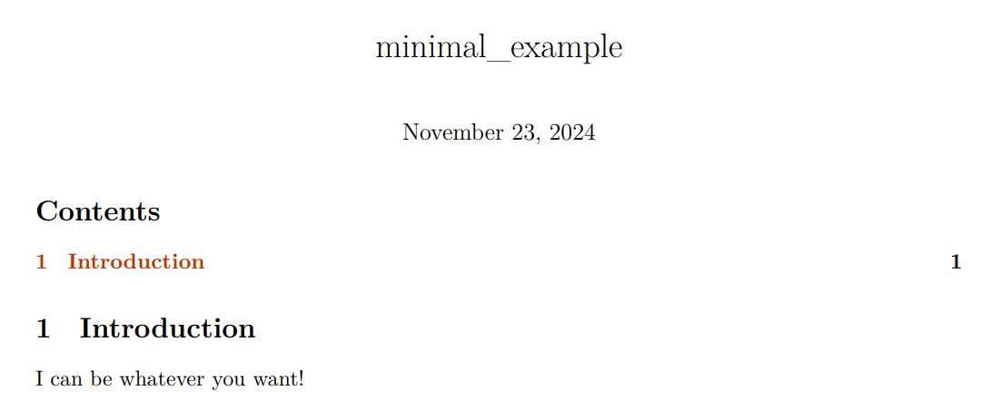

# Automating PDF Reports from Python with Jupyter Notebooks

*My latest preferred method for generating clean automated reports.*

I need my Python design and calculation tools to leave PDF records of their output for quality control purposes. They should not look like unformatted console output, but rather like high-quality, client-ready PDF reports.

My preferred method of sharing Python tools amongst my team is by compiling them to single EXE files with [Nuitka](https://nuitka.net/), and integrating them to our existing MS Office tools (with simple VBA functions). I find the reduced deployment complexity of the `--onefile` option to be well worth its increase in startup time. Some Python libraries, however, are more difficult than others to compile with [Nuitka](https://nuitka.net/).

There are numerous ways to generate PDF reports from Python code - e.g.: [WeasyPrint](https://weasyprint.org/) - and I would like to share my latest and simplest preferred method for doing so, from a coding and sharing perspective.

## Jupyter Notebooks

I already use [Jupyter Notebooks](https://jupyter.org/) for all of my calculation notes and most of my team is now well acquainted with [JupyterLab](https://jupyterlab.readthedocs.io/en/latest/) and its PDF conversion. The notebooks are carefully formatted to produce clean and professional reports, and most if not all of the code is hidden in the PDF output. The functions are typically replaced with [LaTeX](https://www.latex-project.org/) formulas (either manually or using [handcalcs](https://github.com/connorferster/handcalcs)), and we require that quality control can be entirely performed on the PDF, without having to consult the underlying (and hidden) code.

Since our team and clients are already familiar with this presentation, it makes sense to replicate if for our automated reports.

## Notebook Templater

I have recently published a small packaged, named [eznbtemplater](https://github.com/miek770/eznbtemplater) (as in *easy notebook templater*), to facilitate the creation of professional looking reports and calculation notes programatically, without having to learn extensive templating engines or mess with more [LaTeX](https://www.latex-project.org/) than desired.

Although I am very satisfied with the result, its main issue for my usecase is the relyance on [nbconvert](https://nbconvert.readthedocs.io/en/latest/) which doesn't work without extra steps with [Nuitka](https://nuitka.net/), and appears to make the resulting build bloated.

My solution is to only reproduce the `render_nb()` and `_process_template()` functions in [eznbtemplater.py](https://github.com/miek770/eznbtemplater/blob/main/eznbtemplater/eznbtemplater.py), which only require [nbformat](https://nbformat.readthedocs.io/en/latest/).

The integration is very similar to my [From Dynamically Defined Template example](https://github.com/miek770/eznbtemplater/tree/main#from-dynamically-defined-template), except that `render_nb()` is not imported from [eznbtemplater](https://github.com/miek770/eznbtemplater).

The drawback is that the output is a notebook file (`.ipynb`) instead of a PDF, but that's arguably better because it allows users to personalize the content and change the filename before its PDF conversion (the filename appears as the PDF document title, without the extension).

## Nuitka Compilation

I love using [uv](https://docs.astral.sh/uv/) for my projects (see [My Python TUI Project Template](https://codecurrents.blog/article/2024-10-14)), and a [Makefile](https://en.wikipedia.org/wiki/Make_(software)#Makefile) to manage repetitive actions. Here's a typical [Makefile](https://en.wikipedia.org/wiki/Make_(software)#Makefile) for a CLI project I manage:

```makefile
NAME = $(shell grep '^name =' pyproject.toml | sed -E 's/name = "(.*)"/\1/')
VERSION = $(shell grep '^version =' pyproject.toml | sed -E 's/version = "(.*)"/\1/')

build:
	uv run python -m nuitka --onefile --include-package-data=nbformat --include-package=tabulate --output-filename=$(NAME)_v$(VERSION).exe src/cli.py

info:
	@echo $(NAME), version $(VERSION)

tests:
	uv run python -m pytest

.PHONY: build info tests
```

I believe [tabulate](https://pypi.org/project/tabulate/) is required by the [pandas.DataFrame.to_markdown()](https://pandas.pydata.org/docs/reference/api/pandas.DataFrame.to_markdown.html) method, but is not listed in [pandas](https://pandas.pydata.org/docs/index.html)' dependencies and therefore must be added manually. I'm not sure if that's intended to be an optional dependency or if it's an oversight, but it needs to be included manually.

[nbformat](https://nbformat.readthedocs.io/en/latest/)'s data must be added with `--include-package-data=nbformat` to include the template files in the compiled application.

## Minimal Example

Here's a minimal but complete example that creates a notebook programmatically using the method presented in this article:

```python
import nbformat as nbf
from pathlib import Path


def render_nb(
    *,
    template: nbf.NotebookNode,
    output_path: Path,
    **kwargs,
) -> None:

    def _process_template(
        nb: nbf.NotebookNode,
        **kwargs,
    ) -> nbf.NotebookNode:

        # Replace placeholders in the notebook
        for cell in nb.cells:
            for key in kwargs.keys():
                if f"{{{{{key}}}}}" in cell.source:
                    cell.source = cell.source.replace(
                        f"{{{{{key}}}}}",
                        kwargs[key],
                    )
                    if f"{key}_cell_type" in kwargs.keys():
                        cell.cell_type = kwargs[f"{key}_cell_type"]

        return nb

    # Replace {{keys}} in the template
    nb: nbf.NotebookNode = _process_template(
        nb=template,
        **kwargs,
    )

    # Write the modified notebook to a temporary file
    with open(output_path, "w", encoding="utf-8") as output_file:
        nbf.write(nb, output_file)


# Create the template
nb: nbf.NotebookNode = nbf.v4.new_notebook()
nb["cells"] = [
    nbf.v4.new_raw_cell(r"\tableofcontents"),
    nbf.v4.new_markdown_cell("# Introduction"),
    nbf.v4.new_markdown_cell("{{intro}}"),
]

# Render the notebook using the template and "intro" field
render_nb(
    template=nb,
    output_path=Path("minimal_example.ipynb"),
    intro="I can be whatever you want!",
)
```

The output, once printed to PDF through [JupyterLab](https://jupyterlab.readthedocs.io/en/latest/) (or using [nbconvert](https://nbconvert.readthedocs.io/en/latest/) directly), looks like this:



## Closing Thoughts

On Windows, I use `os.startfile( <report.ipynb> )` to automatically open the report after its creation *using the OS' default application for .ipynb files*. That's [VS Code](https://code.visualstudio.com/) in my case and it works well enough with notebooks.

I use a few different VBA functions to launch executables from MS Access, with or without arguments, with or without waiting for the output. I can share those if anyone's interested.

My previously preferred method relied on [Jinja](https://jinja.palletsprojects.com/en/stable/) and [WeasyPrint](https://weasyprint.org/), but some antivirus solution appear to have issues with the latter. I also haven't tried bundling them into a single file EXE with [Nuitka](https://nuitka.net/) so I can't comment. Overall, I would much rather work with notebooks.